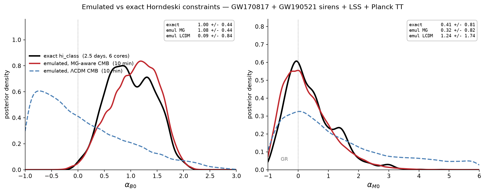

# gwmg

A Python 3 / CosmoSIS 3 pipeline for constraining modified gravity with
gravitational-wave standard sirens and large-scale-structure data.

gwmg implements the framework of Baker & Harrison (2020), arXiv:2007.13791.
hi_class computes the Horndeski cosmology and the modified gravitational-wave
luminosity distance; CosmoSIS combines a GW standard-siren likelihood with CMB,
RSD and BAO data to constrain the Horndeski functions alpha_M and alpha_B.

It began as a rebuild of an MSc thesis pipeline (Python 2.7, a lost interface
module, hardcoded cluster paths) and is now a modernised, tested, installable
version.

## Contents

- `gwmg.gw_log_likelihood`: the GW siren log-likelihood (numpy/scipy only)
- a CosmoSIS `dgw` module and a hi_class-to-CosmoSIS interface
- pipeline configs (a quick test run and the full GW+LSS chain) and the
  GW170817 + GW190521 data
- a `gwmg` command line: `info`, `run`, `plot`, `validate`
- corner/contour plotting with ChainConsumer
- CosmoPower neural-network emulators of the CMB, matter power and growth, an
  `Emulator` Python API, a drop-in CosmoSIS module that replaces hi_class, and a
  three-level validation suite (`emu-gen`, `emu-train`, `emu-validate`,
  `emu-chi2`, `emu-bias`) — see the [Emulator](#emulator) section below and
  `docs/emulator.md`

## Install

gwmg has two parts: the Python package (the likelihood, CLI and plotting, which
install with pip) and the heavier CosmoSIS 3 + hi_class stack it drives (which
is installed separately, because it is not pip-installable).

Install the package straight from GitHub:

    pip install git+https://github.com/APersonalVoyage/gwmg.git

Or clone it first, which also gives you the configs, data and tests locally and
lets you modify the code:

    git clone https://github.com/APersonalVoyage/gwmg.git
    cd gwmg
    pip install -e .[dev]

Check the core works (this needs no CosmoSIS):

    gwmg validate

That gives you the GW likelihood, the `gwmg` command line and plotting. To run
the full pipeline you also need CosmoSIS 3 and hi_class; see `docs/install.md`
for those.

## Usage

    gwmg info
    gwmg run hi_class_test --test
    gwmg run gw_lss_emcee --mpi 8
    gwmg plot output/gw_lss_horndeski.txt --outdir plots

## Validation

The pipeline is checked against Baker & Harrison (2020): the GW luminosity
distance (their eq. 2.12), the alpha_i proportional-to-Omega_Lambda ansatz
(eq. 2.14), and the lensing and peculiar-velocity error model (eqs. 3.9-3.11).
See `docs/validation.md`.

## Emulator

Running the exact pipeline is slow because every step solves the full
cosmological equations, so a full chain takes days. gwmg includes CosmoPower
neural-network emulators (arXiv:2106.03846) of the expensive physics, and the
same inference runs in about ten minutes:

| | alpha_B0 | alpha_M0 | wall time |
|---|---|---|---|
| exact hi_class | 1.00 +/- 0.44 | 0.41 +/- 0.81 | days, 6 cores |
| **emulated** | **1.08 +/- 0.44** | **0.32 +/- 0.82** | **10 min, 1 core** |

The emulated pipeline recovers the exact Horndeski constraints to a few per cent
in the marginal widths. Getting there needed one design choice that is easy to
get wrong: the **CMB emulator has to include alpha_M and alpha_B as inputs**.
Emulating the CMB in LCDM only, on the argument that modified gravity barely
changes the temperature spectrum, degrades alpha_M by more than a factor of two
and biases alpha_B — the small effect that argument dismisses is exactly the
likelihood curvature that constrains alpha. The full methodology, including why
per-multipole accuracy metrics mislead, is in `docs/emulator.md` and
`docs/analysis_and_results.md`.

### What is emulated

| Quantity | Inputs | Accuracy |
|---|---|---|
| CMB TT C_ell (2 <= l <= 2600) | 8 params, **including alpha_M0, alpha_B0** | 0.17% median |
| Linear P(k), sigma_8 | 8 params | 0.1% median |
| Growth f-sigma_8(z), 0 < z < 1.5 | 8 params | 1.2% median |
| Distances, H(z), sound horizon, GW distance ratio | computed exactly, not emulated | 0.02-0.2% vs hi_class |

The background is analytic for an LCDM expansion, so only the perturbation
spectra are worth emulating.

### Setup

The emulator needs CosmoPower and TensorFlow, which pin `numpy<1.25` and so
cannot share an environment with a modern `classy`. Use the provided file:

    conda env create -f environment-emulator.yml
    conda activate gw-emu
    export GWMG_EMU=/path/to/where/your/emulators/live

### Using the emulators directly

    from gwmg.emulator import Emulator

    emu = Emulator("emulators")     # dir with emu_cl_tt, emu_logpk, emu_fsigma8
    out = emu.predict(omega_m=0.315, h0=0.674, omega_b=0.049, n_s=0.965,
                      A_s=2.1e-9, tau=0.054, alpha_B0=1.0, alpha_M0=0.5)

    out.ell, out.cl_tt, out.dl_tt   # CMB TT
    out.k_h, out.pk, out.sigma8     # linear P(k) and sigma_8
    out.z, out.fsigma8              # growth
    out.z_bg, out.dgw_ratio         # d_L^GW / d_L^EM (the siren observable)

About 7 ms per call, against ~6.4 s for the equivalent hi_class evaluation.
Parameters outside the training box raise `ValueError`.

### Running the accelerated chain

    gwmg run gw_lss_emulated

`configs/gw_lss_emulated.ini` is identical to the exact `gw_lss_emcee.ini` except
that the hi_class module is swapped for `modules/emulator_interface.py`, so the
two are directly comparable.

### Training your own

Trained weights are not distributed (they are large and tied to a specific
hi_class build; an emulator trained on a different Boltzmann code introduces a
measurable bias). Regenerate them — steps 1 and 4 in the `gw-hiclass`
environment, 2 and 3 in `gw-emu`:

    # 1. training data (hours on ~6 cores)
    python scripts/generate_lcdm_tt.py -n 8000 --outdir training_set --seed 1 --workers 6
    python scripts/generate_growth.py  -n 8000 --outdir training_growth --seed 3 --workers 6

    # 2. train (minutes).  --mg gives the 8-parameter, MG-aware CMB emulator
    python scripts/train_lcdm_tt.py training_set --model-dir emulators --mg --lr 0.01
    python scripts/train_growth.py  training_growth --model-dir emulators

    # 3. accuracy per multipole
    gwmg emu-validate test_set --model-dir emulators --report accuracy.txt

    # 4/5. parameter bias (derivatives in gw-hiclass, analysis in gw-emu)
    python scripts/fisher_deriv_tt.py --out fisher_deriv.npz
    gwmg emu-bias --deriv fisher_deriv.npz --model-dir emulators

### Scope

Valid for the `propto_omega` ansatz with an LCDM expansion (w = -1),
alpha_T = alpha_H = 0, alpha_K fixed, TT only, massless neutrinos, and inside the
trained box (alpha_B0 in [-1, 3], alpha_M0 in [-1, 6], standard parameters a few
sigma around Planck). Anything beyond that needs retraining, which the scripts
above support. Full detail and limitations: `docs/emulator.md`.

## Status

The pipeline runs and reproduces the physics of the source paper, and the
emulator is validated end to end against it. Trained emulator weights are not
committed (they are large and tied to a specific hi_class build); the generation,
training and validation tooling to reproduce them is in `scripts/` and the
`gwmg emu-*` commands. See `docs/emulator.md` for scope and limitations.

## License

MIT. See `LICENSE`.
